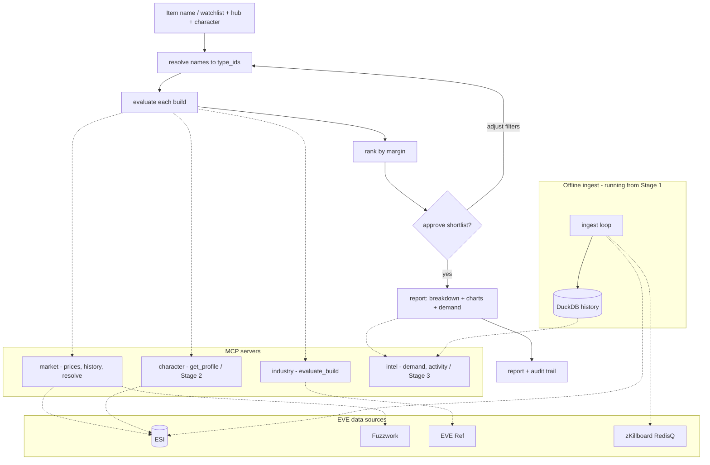

# Forge Analyst — architecture & design

An EVE Online industry-trading copilot built on **LangGraph** (orchestration) + **MCP** (tools). This is the design reference; the staged delivery lives in `ROADMAP.md`, and the hands-on Stage 1 build in `TUTORIAL.md`.

The end state: search for an item, get a true build-cost / profit / time breakdown at a hub for a given character, rank a watchlist by margin, approve the shortlist, and get a report with 90-day price charts and a replacement-demand signal. The money maths stays deterministic; an optional LLM only handles language and judgement.

---

## The three seams (decide once, save rework across stages)

1. **Skills-parametric calc.** Every cost/fee/time function takes a *profile* argument — never assumes skill or blueprint levels internally. Stage 1 hand-enters it; Stage 2 pulls it from ESI. Stage 2 is a change of *source*, not a rewrite.
2. **Framework-first.** Even Stage 1's single-item lookup runs through MCP servers behind a minimal LangGraph graph. The frameworks are the point; we grow into them rather than retrofit.
3. **Ingest-early.** The demand model is Stage 3, but its data ingest (a background logger to DuckDB) switches on in Stage 1 so the history is there when the model needs it.

---

## Domain model (get this right before coding)

The correction that makes the calculator correct rather than plausible: **character skills do not reduce material quantities.** Material reduction comes from the blueprint's **ME level** plus **structure/rig bonuses**. Skills hit profit in two other places — build *time* (Industry / Advanced Industry) and **trading fees** (Accounting reduces sales tax, Broker Relations reduces broker fees). So the per-skill logic lives on time and fees, never on material quantities.

```
material_cost    = sum(qty_after_ME_and_rigs * material_buy_price_at_hub)
job_install_cost = EIV * system_cost_index_total + facility_tax + scc_surcharge + alpha_tax
sell_revenue     = output_qty * output_sell_price_at_hub
sales_tax        = sell_revenue * effective_sales_tax(Accounting)
broker_fee       = sell_order_value * effective_broker_rate(Broker Relations, standings)

profit = sell_revenue - sales_tax - broker_fee - material_cost - job_install_cost
margin = profit / (material_cost + job_install_cost)
```

Two embedded gotchas: **EIV uses CCP's adjusted prices, not hub prices** — the job fee is computed on a smoothed value, not what you actually pay for materials; keep them as distinct numbers. And the **SCC surcharge is 4% and fixed** — nothing reduces it.

### Where each piece of data lives

| Need | Source |
|---|---|
| Name → type_id (the front door) | **ESI** `/universe/ids/` (exact match) or `/search`; or the Fuzzwork type dump |
| Recipe + ME effect | **SDE** (not ESI). Fuzzwork SDE, or EVE Ref reference-data (`ref-data.everef.net/blueprints`) |
| Whole industry calc in one call | **EVE Ref Industry Cost API** (`api.everef.net/v1/industry/cost`) — ME-applied quantities, EIV, system cost index, SCC surcharge, facility tax, totals. Local Docker option. |
| Current material / output prices at a hub | **Fuzzwork** market API |
| 90-day min / avg / max + volume | **ESI** `/markets/{region_id}/history/` |
| Character skills / blueprints / standings | **ESI** authenticated (EVE SSO) — Stage 2 |
| Destruction (replacement demand) | **zKillboard** RedisQ stream + EVE Ref killmail dumps — Stage 3 |
| System activity | **ESI** `/universe/system_kills/` + `/universe/system_jumps/` — Stage 3 |

**Industry shortcut:** use EVE Ref for the ME-applied quantities + job cost, then **reprice the materials and output with Fuzzwork** for your hub (EVE Ref's prices are adjusted-price-based, not "what I pay in Jita now"). Correct, hub-specific numbers without re-deriving the ME rounding yourself.

---

## Architecture



**Two layers, kept clean.** LangGraph owns control flow — resolve, evaluate, the rank/approve loop, when to pause. MCP owns tool access — each server is a separate process with one responsibility. Plus a deliberate third thing the diagram separates out: the **offline ingest limb**, which is stateful and scheduled, unlike the on-demand agent.

### Component inventory

| Server | Stage | Tools | Reads from |
|---|---|---|---|
| `market` | 1 | `price_history`, `current_prices`, `resolve` | Fuzzwork, ESI |
| `industry` | 1 | `evaluate_build` | EVE Ref (+ market prices) |
| `character` | 2 | `get_profile` (multi-character) | ESI authenticated (skills, blueprints, standings) |
| `intel` | 3 | `destroyed_volume`, `system_activity` | DuckDB (fed by ingest) |
| `ingest` (offline) | 1 → | — | zKillboard RedisQ, ESI system kills/jumps → DuckDB |

### The profile seam (contract)

The single most important interface. Stage 1 and Stage 2 must agree on it exactly:

```python
@dataclass
class Profile:
    me: int = 10              # blueprint material efficiency (0-10)
    te: int = 20              # blueprint time efficiency (0-20)
    accounting: int = 0       # reduces sales tax
    broker_relations: int = 0 # reduces broker fee
    industry: int = 0         # build time (Stage 2)
    advanced_industry: int = 0
    character_id: int | None = None
    label: str = "manual"

def evaluate_build(product_id: int, profile: Profile, hub: str = "jita", runs: int = 1) -> dict: ...
```

Stage 1 builds the `Profile` by hand; Stage 2's `character` server returns the identical shape from ESI, keyed by `character_id`. Nothing downstream changes.

---

## Tech stack

Python 3.11+.

| Concern | Choice |
|---|---|
| Orchestration | `langgraph` |
| Agent/model glue | `langchain` (`create_agent`, `init_chat_model`) — only once the LLM layer lands |
| MCP bridge | `langchain-mcp-adapters` (`MultiServerMCPClient`) |
| Authoring MCP servers | `mcp` SDK / `FastMCP` |
| HTTP to EVE APIs | `httpx` (async) |
| History store (ingest) | `duckdb` |
| Charts | `plotly` |
| Persistence / audit | LangGraph SQLite checkpointer |
| Auth (Stage 2) | EVE SSO OAuth2 + PKCE, read-only scopes |

---

## Repo structure

```
forge-analyst/
├── eve_constants.py        # hub/region/station ids
├── eve_api.py              # plain functions: resolve, prices, history, industry, evaluate_build, Profile
├── servers/
│   ├── market_server.py    # price_history, current_prices, resolve
│   ├── industry_server.py  # evaluate_build
│   ├── character_server.py # get_profile (Stage 2, authenticated)
│   └── intel_server.py     # destroyed_volume, system_activity (Stage 3)
├── ingest.py               # background logger -> intel.duckdb (running from Stage 1)
├── state.py                # typed graph state
├── graph.py                # resolve -> evaluate -> rank -> approve -> report
├── charts.py               # 90-day history charts
├── run.py / run_hitl.py    # entry points
├── tests/                  # profit-maths unit tests (verify vs known builds)
└── data/                   # watchlists, SDE snapshot
```

---

## Cross-cutting concerns

- **Audit trail.** The SQLite checkpointer records every price, profile and assumption per run — design graph state assuming it's all persisted and read back. This is the explainability/portfolio angle, not a side effect.
- **Security (Stage 2).** PKCE means no client secret in the codebase; use read-only scopes; keep refresh tokens out of the repo (gitignore / config dir). Changing requested scopes forces a re-login.
- **Context budget.** MCP tool schemas are verbose; a multi-server setup can eat a large share of the window. Keep tool counts lean and only attach what a node needs.
- **ESI etiquette.** Use the `X-Compatibility-Date` header (not `/latest/`), send a real `User-Agent`, cache history (changes once a day), and respect the error limit.
- **Async.** MCP clients and `httpx` are async — keep the boundary clean so nodes don't fight the event loop.

---

## Likely gotchas

- **Recipe data is in the SDE, not ESI** — that's why we lean on EVE Ref.
- **EIV ≠ what you pay** — job cost on adjusted prices, materials on hub prices; distinct fields.
- **Skills affect fees + time, not material quantities.**
- **SCC surcharge is 4% and fixed.**
- **zKillboard coverage is partial** — it only has killmails someone shared, so losses are undercounted; treat the demand signal as a proxy, not a census.
- **interrupt() re-runs the node from the top on resume** — side effects go *after* the interrupt.

---

## See also

- `ROADMAP.md` — the three delivery stages and what each adds.
- `TUTORIAL.md` — the hands-on Stage 1 build, part by part.
