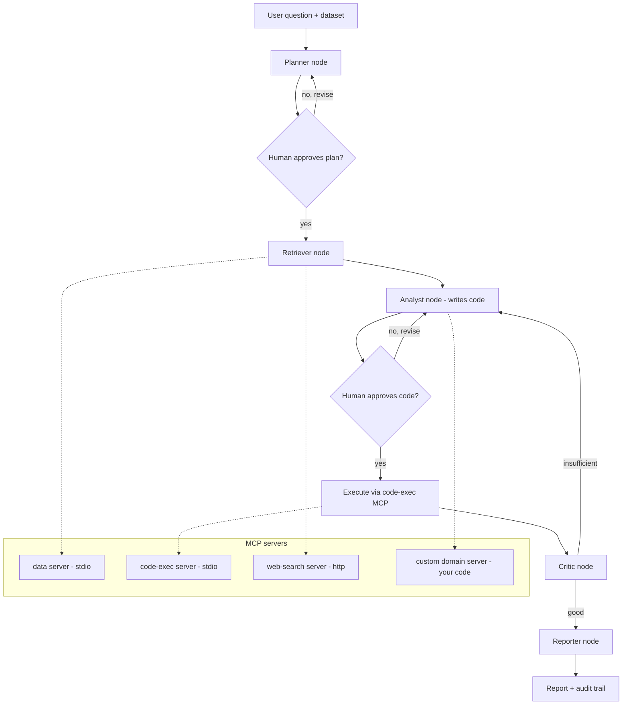

# Insight Agent — Project Plan

An agentic data-analysis assistant built on **LangGraph** (orchestration) + **MCP** (tools), built end-to-end using **Claude Code** as the dev environment.

The point of the project is the *plumbing experience*, not the cleverness of the analysis. By the end you'll have written a LangGraph state machine with a human-in-the-loop gate, wired up multiple MCP servers (including one you author yourself), and driven the whole build through Claude Code's agentic workflow.

---

## 1. Learning objectives

By completion you should be able to do each of these from memory:

- Build a `StateGraph` with conditional edges and a cyclic critic/refine loop.
- Add a human-in-the-loop checkpoint with `interrupt()` and resume from it.
- Persist runs with a checkpointer (SQLite) so a run is resumable *and* auditable.
- Consume tools from **multiple** MCP servers over different transports (stdio + streamable HTTP) via `MultiServerMCPClient`.
- **Author your own MCP server** (FastMCP) that wraps a Python model/function.
- Drive a real build with Claude Code: `CLAUDE.md`, plan mode, custom subagents, project-scoped MCP.

---

## 2. What it does (scope)

Given a tabular dataset and a natural-language question, the agent:

1. **Plans** an analysis (what to compute, in what order).
2. **Pauses for your approval** of the plan before doing anything (human-in-the-loop gate #1).
3. **Retrieves** the relevant data (filesystem / DuckDB MCP).
4. **Executes** analysis code in a sandbox (code-exec MCP) — with an approval gate before running generated code (gate #2).
5. **Critiques** its own result and loops back if the answer is weak or the code errored.
6. **Reports** with a written summary, the numbers, and a full trace of what it did.

Explicit non-goals (write these into `CLAUDE.md` so Claude Code doesn't gold-plate): no web UI in v1 (CLI + LangGraph Studio is enough), no auth, no multi-user, no cloud deploy.

---

## 3. Architecture



**Two layers, kept clean:**

- **LangGraph** owns control flow — which node runs next, when to loop, when to pause for a human. State lives in the graph.
- **MCP** owns tool access — each capability is a separate server process the graph calls through the adapter. This is deliberately more infrastructure than native LangChain `@tool` functions would need; the *reason* to use MCP here is the learning, plus the portability (the same servers work with Claude Code, Cursor, etc.).

**The pluggable slot:** the `custom domain server` is where you make it yours. v1 = a small stats utility (e.g. effect-size / confidence-interval helper the LLM can't reliably do in its head). Later, swap in your transaction classifier or the D&D combat simulator with zero changes to the graph.

---

## 4. Tech stack

Grounded against current packages (Python 3.11+ required):

| Concern | Choice |
|---|---|
| Orchestration | `langgraph` |
| Agent/model glue | `langchain` (`create_agent`, `init_chat_model`) |
| MCP bridge | `langchain-mcp-adapters` (`MultiServerMCPClient`) |
| Authoring MCP servers | `mcp` SDK / `FastMCP` |
| Data | `duckdb`, `pandas`, `pyarrow` |
| Persistence | LangGraph SQLite checkpointer |
| Model | Claude (Sonnet for build/dev loops; the agent itself can run on whatever you have keys for) |
| Dev environment | Claude Code |

> Watch the context budget: MCP tool schemas are verbose, and a multi-server setup can quietly eat a large share of the window before the agent processes a single message. Keep the active tool count lean and only attach the servers a given node needs.

---

## 5. Build plan (phased)

Each phase is a self-contained Claude Code session. Use plan mode at the start of each: write the phase spec, ask Claude for an implementation plan, review and approve *before* it writes code.

### Phase 0 — Repo + Claude Code scaffolding (½ day)
- `uv`/`venv`, project layout, ruff/pyright, pytest.
- Write `CLAUDE.md`: stack, conventions, the non-goals list, "propose before you build."
- Create one custom subagent in `.claude/agents/` for read-heavy work (e.g. a `graph-reviewer` that only has Read/Grep/Glob and reviews graph wiring).
- **DoD:** `claude` opens cleanly, `CLAUDE.md` is loaded, tests run green on an empty skeleton.

### Phase 1 — One MCP server, end to end (1 day)
- Author the **custom domain server** first (FastMCP), exposing 1–2 tools. Start here because authoring is the highest-value skill and the smallest moving part.
- Wire it into a *minimal* LangGraph agent via `MultiServerMCPClient` (stdio transport). No critic loop yet — just question → tool call → answer.
- **Also add this server to Claude Code itself** (`claude mcp add`, project scope so it lands in `.mcp.json`) and call it interactively — you're now dogfooding your own MCP server.
- **DoD:** the agent answers a question using your tool; `/mcp` in Claude Code shows it connected.

### Phase 2 — Multi-server + data (1–2 days)
- Add the data server (DuckDB/filesystem, stdio) and a web-search server (HTTP transport) — proves you can mix transports.
- Build the Planner → Retriever → Analyst → Execute path as real graph nodes with typed state.
- **DoD:** end-to-end run on a sample CSV produces a (possibly rough) answer.

### Phase 3 — The interesting LangGraph bits (2 days)
- Add the **Critic node** and the conditional edge that loops back to Analyst on a weak/errored result. This is the cyclic-graph payoff.
- Add **human-in-the-loop gates** with `interrupt()`: pause after planning and before code execution; resume on approval.
- Add the **SQLite checkpointer**: runs become resumable and every step is recorded — this doubles as your audit trail (lean into this, it's your regulated-sector angle).
- **DoD:** you can approve/reject a plan mid-run, kill the process, and resume the same run later.

### Phase 4 — Reporting, polish, demo (1–2 days)
- Reporter node emits a markdown report: question, approved plan, code run, result, and the step trace pulled from the checkpointer.
- Inspect/debug graphs visually in LangGraph Studio.
- Record a 2-minute demo and write the README around the architecture diagram above.
- **DoD:** a clean run from question to report, plus a README a stranger could follow.

---

## 6. Repo structure

```
insight-agent/
├── CLAUDE.md
├── .mcp.json                 # project-scoped MCP servers (shared, committed)
├── .claude/
│   └── agents/
│       └── graph-reviewer.md
├── servers/
│   ├── domain_server.py      # your FastMCP server (the pluggable slot)
│   ├── data_server.py
│   └── search_server.py
├── src/
│   ├── graph.py              # StateGraph definition
│   ├── nodes/                # planner, retriever, analyst, critic, reporter
│   ├── state.py              # typed graph state
│   └── mcp_client.py         # MultiServerMCPClient setup
├── tests/
└── data/                     # sample datasets
```

---

## 7. Key snippets to anchor each piece

**Custom MCP server (FastMCP) — Phase 1:**
```python
# servers/domain_server.py
from mcp.server.fastmcp import FastMCP

mcp = FastMCP("domain")

@mcp.tool()
def confidence_interval(mean: float, sd: float, n: int) -> dict:
    """Return a 95% CI — the kind of thing an LLM shouldn't eyeball."""
    se = sd / (n ** 0.5)
    return {"low": mean - 1.96 * se, "high": mean + 1.96 * se}

if __name__ == "__main__":
    mcp.run(transport="stdio")
```

**Multi-server client — Phase 2:**
```python
# src/mcp_client.py
from langchain_mcp_adapters.client import MultiServerMCPClient

client = MultiServerMCPClient({
    "domain": {"command": "python", "args": ["servers/domain_server.py"], "transport": "stdio"},
    "data":   {"command": "python", "args": ["servers/data_server.py"],   "transport": "stdio"},
    "search": {"url": "http://localhost:8000/mcp", "transport": "http"},
})
# tools = await client.get_tools()  -> hand to your nodes / create_agent
```

**Graph skeleton with a critic loop — Phase 3:**
```python
# src/graph.py (sketch)
from langgraph.graph import StateGraph, START, END

builder = StateGraph(AgentState)
for name, fn in [("planner", plan), ("retriever", retrieve),
                 ("analyst", analyse), ("critic", critique), ("reporter", report)]:
    builder.add_node(name, fn)

builder.add_edge(START, "planner")
# ... interrupt() gates around planner/analyst go in the node fns ...
builder.add_conditional_edges("critic", lambda s: "reporter" if s["ok"] else "analyst")
builder.add_edge("reporter", END)
# graph = builder.compile(checkpointer=SqliteSaver(...))
```

---

## 8. Claude Code workflow notes

- **`CLAUDE.md` is the constitution** — when output surprises you (wrong assumption, wrong schema), fix `CLAUDE.md`, don't just re-prompt. Fix the context, not the conversation.
- **Plan mode per phase** — spec → plan → your approval → execute. You make the architectural calls; Claude proposes.
- **Subagents for bounded jobs** — a reviewer agent with read-only tools keeps your main context clean and gives you a second pair of eyes on graph wiring.
- **Model routing** — `/model opusplan` (or similar) lets a stronger model plan while a cheaper one executes.
- **MCP scopes** — local (just you), project (`.mcp.json`, committed/shared), user (all your projects). Use project scope here so the repo is self-describing.
- **Don't over-attach MCP servers in Claude Code** — same context-bloat caveat as the agent itself; only enable what the current task needs.

---

## 9. Stretch goals (pick later, don't pre-build)

- Swap the domain server for your **transaction classifier** or **D&D combat simulator** — same graph, new personality.
- Add a **supervisor** layer routing between specialist sub-agents.
- Add MCP **interceptors** to inject run context / enforce retries on tool calls.
- Thin web UI over the graph once the engine is solid.

---

## 10. Likely gotchas

- **Async everywhere** — MCP clients are async; keep the boundary clean so sync nodes don't fight the event loop.
- **stdio servers are subprocesses** — absolute paths, and they die with the client; fine for local dev, reconsider for anything hosted.
- **Context bloat from tool schemas** — the single most common failure mode in multi-server setups. Measure it early.
- **Checkpointer = audit trail** — design the state shape on the assumption every field gets persisted and read back; it's a feature, treat it like one.